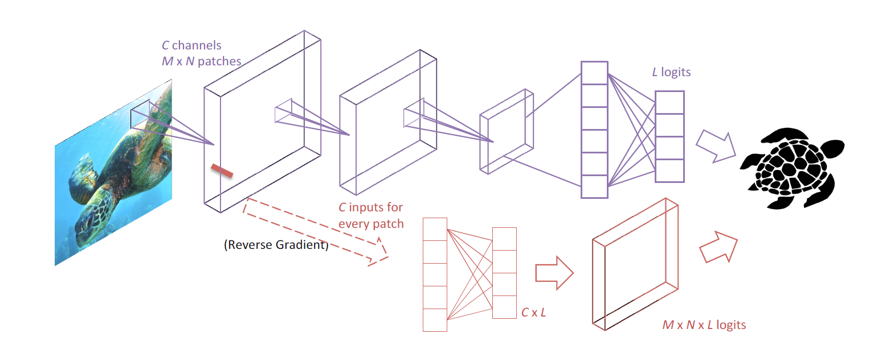

# Patch-wise Adversarial Regularization

### Example Usage of the Regularization

- [example/AlexNet.py](https://github.com/HaohanWang/PAR/blob/master/example/alexNet.py)
    - Example usuage of how to plug in our idea into existing AlexNet
    - One only need to concern with the codes controlled by the boolean varialable adv_flag, including:
        -  [Line 182](https://github.com/HaohanWang/PAR/blob/master/example/alexNet.py#L182)
        -  [Line 291](https://github.com/HaohanWang/PAR/blob/master/example/alexNet.py#L291)
        -  [Line 317](https://github.com/HaohanWang/PAR/blob/master/example/alexNet.py#L317)
- utility/ 
    - Other codes needed to run the AlexNet, not part of the contributions of this repository
    
### Reference

If you find this method helpful, please consider cite: 
    
&emsp; _Haohan Wang, Songwei Ge, Eric P. Xing, and Zachary C. Lipton. "[Learning Robust Global Representations by Penalizing Local Predictive Power](https://arxiv.org/abs/1905.13549)" (NeurIPS 2019)_
